# MELD Mentor Interviewer v2 — Product & Technical Requirements

> **Audience:** Full‑stack engineer(s) extending the existing LibreChat fork that powers MELD.
> **Last updated:** 2025‑05‑28

---

## 1  Objective

Design and ship the "adaptive" Mentor Interviewer flow that:

1. **Captures** a mentor’s narrative via audio ✚ text.
2. **Surfaces** semantically‑similar, high‑value follow‑up questions from our curated question bank (Mongo → RAG → GPT‑4).
3. **Lets mentors pick 3 keywords** ("tags") that best resonate with each answer.
4. **Iterates for 3 rounds,** storing every artefact (audio/text, chosen tags, AI‑chosen next question) with versioned persistence.
5. **Returns** mentors to the dashboard upon completion.

The experience must feel seamless, respect existing MELD styling tokens, and minimise hard‑coding so future editors can tweak copy/questions without code changes.

---

## 2  Key User Stories

|  ID | As a …     | I want to …                                                  | So that …                                 |
| --- | ---------- | ------------------------------------------------------------ | ----------------------------------------- |
|  U1 | Mentor     | Record/type my answer to the first intro prompt              | MELD can personalise subsequent questions |
|  U2 | Mentor     | See visually how many questions remain                       | Manage my time                            |
|  U3 | Mentor     | Pick 3 keywords that best fit my last answer                 | Ensure follow‑ups feel relevant           |
|  U4 | System     | Persist every answer + tag choice in real‑time               | No work is lost on refresh                |
|  U5 | AI Service | Retrieve semantically‑closest questions to a mentor’s answer | Seed GPT with high‑quality context        |
|  U6 | AI Service | Compose a fresh, contextualised question                     | Conversation feels bespoke                |

---

## 3  High‑Level Flow

```mermaid
sequenceDiagram
    participant M as Mentor (UI)
    participant FE as Front‑end (React)
    participant API as Express API
    participant RAG as RAG svc
    participant GPT as OpenAIClient

    M->>FE: Answer Q1 (audio / text)
    FE->>API: POST /responses {stage:1, text}
    API->>Mongo: save
    FE->>API: GET /questions/similar?text=...
    API->>RAG: /query → top‑10 hits
    RAG-->>API: file_ids[] (scores)
    API->>Mongo: find({_id:{$in:file_ids}})
    API-->>FE: 10 questions (text + tags)
    M->>FE: Picks 3 tags
    FE->>API: POST /responses/{stage:1}/tags
    FE->>API: POST /next‑question {priorAnswers}
    API->>GPT: system+user msgs
    GPT-->>API: {question_text, based_on_id}
    API-->>FE: next question
    FE-->>M: Render Q2 …
```



---

## 4  Functional Requirements

### 4.1 Routes

| URL                                | Component                 | Auth | Description                                        |
| ---------------------------------- | ------------------------- | ---- | -------------------------------------------------- |
| `/mentor-interview/start`          | *unchanged*               | ✔    | Entry preamble & scheduling (out of scope)         |
| `/mentor-interview/question/:step` | `MentorInterviewQuestion` | ✔    | 1‑based step navigation; renders **question card** |
| `/mentor-interview/complete`       | `CompletionScreen`        | ✔    | End slate                                          |

### 4.2 Question Rendering

* **First question** remains **hard‑coded** in FE for now (copy in code‑base).
* All subsequent questions are delivered from API response → `question` prop.
* Card anatomy & tokens **must** follow existing Tailwind classes:

  * Background `bg-[#F8F4EB]`
  * Accent `#B04A2F`
  * Progress dots identical CSS (reuse present loop).

### 4.3 Audio/Text Capture (`MentorAudioTextInput`)

* Already implemented; extend so that *onSubmit* **resolves a promise** (API call) before UI allows “Save & continue”.
* Modify debounce save ➜ 1.5 s to lower write‑amplification.

### 4.4 Similar Question Retrieval

Endpoint: `GET /api/mentor-interest/questions/similar`

```http
GET /api/mentor-interest/questions/similar?text=<url‑encoded>&k=10
Headers: Authorization: Bearer <jwt>
Response 200
{
  "items": [
    {"_id":"...","question":"...","pillar":"...","subTags":["preparation","negotiation"]},
    ... x10
  ]
}
```

* **k** default 10; configurable via query.
* Controller pipes `text ➜ RAG ➜ Mongo` as per diagram.

### 4.5 Tag Selection UI

* After answer is saved, UI slides in **TagSelector** sub‑card: 10 chips displayed grid‑wrap (use Tailwind pill variant).
* Chips: white bg, `border-[#C9C9B6]`, selected ‑> `bg-[#B04A2F] text-white`.
* “Continue” button disabled until exactly 3 selected.
* Component props:

  ```ts
  <TagSelector
     options: string[];      // 10 tags
     onSubmit(tags: string[]) => Promise<void>
  />
  ```

### 4.6 Adaptive Question Generation

Endpoint: `POST /api/mentor-interest/:mentor_interest_id/next-question`

```json
{
  "previous_stage_id": 1,
  "answer_text": "...",
  "selected_tags": ["adaptability","negotiation","mindset"]
}
```

Response

```json
{
  "stage_id": 2,
  "question": "How have you adapted your leadership style when entering a new market?",
  "based_on_question_id": "664982..."
}
```

* Internals:

  1. Server fetches ±20 nearest questions (`searchMentorQuestions` reuse).
  2. Builds GPT message array (see §8.3).
  3. Caches chosen question ID & text in new `MentorResponse.stage_id=2` doc **with** `source_question_id` field.
  4. Returns to client.

### 4.7 Persistence Rules

* **MentorResponse** schema additions:

  ```ts
  source_question_id?: ObjectId // link to original question bank
  selected_tags?: string[]      // length=3, optional if stage 1
  version: Number               // auto‑increment on each save
  ```
* `PATCH` writes must enforce **newest‑wins** (version check).
* Index `{ mentor_interest, stage_id }` unique.

### 4.8 Completion Criteria

* After stage 3 => redirect `/mentor-interview/complete`.
* Emit toast “Responses saved”.

---

## 5  Non‑Functional Requirements

### 5.1 Performance

* Each RAG query ≤ 800 ms P95.
* Whole "Save & continue" latency ≤ 2 s.

### 5.2 Resilience

* All POST/GET wrapped in exponential‑backoff retry (front‑end `@tanstack/react-query`).
* Autosave every 15 s **even if paused**.

### 5.3 Accessibility (WCAG 2.1 AA)

* Audio controls keyboard accessible.
* Colour contrast ratio ≥ 4.5.

### 5.4 Security & Privacy

* JWT guard on all mentor APIs.
* Audio blobs stored encrypted at rest (reuse existing bucket policy).
* GDPR: add `DELETE /mentor-responses/:id` endpoint for data erasure.

### 5.5 Analytics

* Fire `mentor_interview_step_completed` with properties `{stage, duration_ms, tag_count}`.

---

## 6  Data Model DDL (Mongoose)

```js
const MentorResponseSchema = new Schema({
  mentor_interest: { type: ObjectId, ref: 'MentorInterest', index: true },
  stage_id:        { type: Number, required: true },
  response_text:   { type: String, default: '' },
  audio_url:       { type: String },
  selected_tags:   [String],
  source_question_id: { type: ObjectId, ref: 'MentorQuestion' },
  version: { type: Number, default: 1 },
  updatedAt: { type: Date, default: Date.now },
});
MentorResponseSchema.index({ mentor_interest:1, stage_id:1 }, { unique:true });
```

*No changes* to `MentorQuestion` except ensure `subTags` is non‑empty array.

---

## 7  API Contract Summary

| Verb | Path                                 | Purpose                        | Status Codes      |
| ---- | ------------------------------------ | ------------------------------ | ----------------- |
| GET  | `/mentor-interest/questions/similar` | Return top‑k similar questions | 200, 400, 401     |
| POST | `/:id/next-question`                 | Create next adaptive question  | 200, 401, 500     |
| POST | `/:id/response/:stage`               | Upsert mentor response         | 201/200, 400, 500 |
| POST | `/:id/response/:stage/tags`          | Save 3 selected tags           | 200               |

*Detailed schemas in appendix A.*

---

## 8  Front‑End Implementation Plan

### 8.1 Component Tree per Step

```
MentorInterviewQuestion
├── ProgressDots
├── QuestionCard
│   ├── Preamble / Supporting / Question / ExtraText
│   └── MentorAudioTextInput
├── TagSelector   ← renders after onSubmit resolves (stage>1)
└── NavFooter (Resume / Skip / Save & Continue)
```

### 8.2 Reusable Primitives

* `<Pill>` – selectable chip, already exists in `ui/`? reuse else create.
* `<ProgressDots>` – extract from current inline map into component.

### 8.3 OpenAIClient Wrapper

`services/openai/generateNextQuestion.ts`

```ts
export async function generateNextQuestion({answer, tags, kHits}: Args): Promise<QuestionOut> {
  const payload = [
    {role:'system', content:`You are MELD's mentor interviewer...`},
    {role:'user', content:`Previous answer:\n${answer}`},
    {role:'user', content:`Key themes: ${tags.join(', ')}`},
    {role:'assistant', content:`Here are ${kHits.length} similar questions: ...`},
    {role:'user', content:'Pick one or craft a better one; reply JSON {"question":"", "based_on_id":"" }'}
  ];
  return openAI.sendCompletion(payload, {model:'gpt-4o-mini',max_tokens:150});
}
```

---

## 9  Styling / Design Tokens

* Primary accent `#B04A2F` (buttons, selected pills, icons)
* Neutral light `#F8F4EB` (background)
* Neutral mid `#C9C9B6` (borders, inactive dots)
* Font stack: "Inter", fallback sans‑serif; headings use `font-serif` class per Tailwind config.

---

## 10  Milestones & Timeline

|  Week  | Deliverable                                    |
| ------ | ---------------------------------------------- |
|  0 – 1 | Schema migration + new endpoints stubbed       |
|  2     | FE TagSelector + autosave refactor             |
|  3     | RAG similarity endpoint + integration test     |
|  4     | GPT Next‑Question service; E2E happy‑path      |
|  5     | QA, a11y sweep, error‑state polish             |
|  6     | Pilot with internal mentors; collect telemetry |

---

## 11  Acceptance Criteria (per Jira tickets)

* AC‑1: Autosave persists on network loss & page refresh.
* AC‑2: Tag chips enforce exactly 3 selection rule.
* AC‑3: GPT output respects 200‑char max question length.
* AC‑4: P95 end‑to‑end latency ≤ 2 s.
* AC‑5: Mobile viewport (`375×667`) passes manual UX test.

---

## 12  Risks & Mitigations

|  Risk                                        | Impact | Mitigation                                                            |
| -------------------------------------------- | ------ | --------------------------------------------------------------------- |
| GPT hallucination returns duplicate question | Medium | Pass candidate through `unique diff` check vs previous stages         |
| RAG latency spike                            | High   | Warm embedding index; fall back to deterministic random question bank |
| Mentors abandon mid‑flow                     | Medium | Autosave + "Resume later" email reminder (future work)                |

---

### Appendix A – API Schemas

📁 API Folder Structure Map
🎯 Core Application Files
package.json - Node.js dependencies and scripts (3.5KB)
typedefs.js - GraphQL/API type definitions (66KB - comprehensive API schema)
jest.config.js - Jest testing configuration
jsconfig.json - JavaScript project configuration
🚀 Core Directories
/server/ - Express Server Core
index.js - Main server entry point and Express app setup
socialLogins.js - Social authentication configuration
cleanup.js - Server cleanup and graceful shutdown (11KB)
/server/routes/ - API Endpoints
mentorInterest.js - Mentor interest management endpoints
auth.js - Authentication routes (login, register, logout)
convos.js - Conversation management endpoints
messages.js - Message CRUD operations (8.9KB)
prompts.js - Prompt management endpoints (6.7KB)
user.js - User profile and settings endpoints
share.js - Conversation sharing functionality
files/ - File upload and management routes
assistants/ - AI assistant configuration routes
agents/ - AI agent management routes
Domain-specific routes: search, tags, oauth, keys, presets, roles
/server/controllers/ - Business Logic
MentorInterestController.js - Mentor workflow business logic (12KB)
AskController.js - Chat/AI interaction logic (7.8KB)
AuthController.js - Authentication business logic
UserController.js - User management operations (6.8KB)
EditController.js - Message editing functionality
PluginController.js - Plugin system management
TwoFactorController.js - 2FA implementation
Domain controllers: agents/, assistants/, auth/
/server/services/ - Service Layer
ToolService.js - Tool integration service (22KB)
ActionService.js - Action execution service (16KB)
AssistantService.js - AI assistant management (14KB)
AuthService.js - Authentication services (13KB)
ModelService.js - AI model management (9.6KB)
UserService.js - User-related services
TokenService.js - Token management and validation
Specialized services: Files/, Threads/, Runs/, Tools/, Config/
/server/middleware/ - Request Processing
Authentication: requireJwtAuth.js, requireLocalAuth.js, requireLdapAuth.js
Validation: validateRegistration.js, validatePasswordReset.js, validateEndpoint.js
Security: checkBan.js, moderateText.js, denyRequest.js
Rate limiting: limiters/, concurrentLimiter.js
Request processing: abortMiddleware.js, buildEndpointOption.js
Specialized middleware: roles/, validate/, assistants/
/models/ - Database Models & Schemas
Mentor System: MentorInterest.js, MentorResponse.js, MentorQuestion.js
Core Models: User.js, Message.js, Conversation.js, Session.js
AI/Chat: Agent.js (12KB), Assistant.js, Prompt.js (16KB)
Content: File.js, Share.js, ToolCall.js, ConversationTag.js
System: Config.js, Token.js, Key.js, Balance.js, Banner.js
Business: Transaction.js (12KB), Project.js, Role.js (9KB)
Helper methods: userMethods.js, balanceMethods.js, spendTokens.js
Testing: Comprehensive .spec.js files for models
Schema definitions: schema/, plugins/
/app/clients/ - AI Client Implementations
AI Provider Clients:
OpenAIClient.js - OpenAI API integration (50KB)
AnthropicClient.js - Anthropic/Claude integration (33KB)
GoogleClient.js - Google AI integration (31KB)
ChatGPTClient.js - ChatGPT-specific client (26KB)
PluginsClient.js - Plugin system client (18KB)
BaseClient.js - Base client class (37KB)
OllamaClient.js - Local Ollama integration
Supporting systems: tools/, agents/, chains/, callbacks/, memory/
Processing: TextStream.js, generators.js
/strategies/ - Authentication Strategies
Core strategies: jwtStrategy.js, localStrategy.js, ldapStrategy.js
Social logins: googleStrategy.js, facebookStrategy.js, githubStrategy.js, discordStrategy.js, appleStrategy.js
OpenID: openidStrategy.js (9KB with comprehensive testing)
Utilities: validators.js, process.js, socialLogin.js
Comprehensive testing: Multiple .spec.js and .test.js files
/config/ - Configuration Management
index.js - Main configuration loader (2.5KB)
winston.js - Logging configuration (3.2KB)
parsers.js - Configuration parsers (6.9KB)
meiliLogger.js - MeiliSearch logging
paths.js - Path configuration
Testing: index.spec.js
/utils/ - Utility Functions
tokens.js - Token management utilities (13KB with extensive testing)
axios.js - HTTP client configuration
azureUtils.js - Azure-specific utilities (4.8KB)
URL processing: extractBaseURL.js, deriveBaseURL.js
Content: findMessageContent.js
System: LoggingSystem.js, logger.js, loadYaml.js
Comprehensive testing: Multiple .spec.js files
/cache/ - Caching & Performance
Redis integration: ioredisClient.js, keyvRedis.js
MongoDB caching: keyvMongo.js (6.5KB)
File caching: keyvFiles.js
Violation tracking: banViolation.js, logViolation.js
Request management: clearPendingReq.js, getLogStores.js (8.8KB)
Testing: Comprehensive .spec.js files
/lib/ - Core Libraries
/db/ - Database utilities
connectDb.js - Database connection management
indexSync.js - Database indexing (2.8KB)
/utils/ - Core utility libraries
/validation/ - Data Validation
mentorInterest.js - Mentor interest validation schemas
/test/ - Testing Infrastructure
jestSetup.js - Jest configuration and setup
__mocks__/ - Mock implementations for testing
/logs/ - Application Logs
Server logs and application monitoring data
🏗️ API Architecture Summary
This is a comprehensive Node.js/Express API with:
🔧 Technical Stack
Express.js server with comprehensive middleware
MongoDB with Mongoose ODM (extensive model definitions)
Redis for caching and session management
JWT + Passport.js for authentication
Multiple AI provider integrations (OpenAI, Anthropic, Google, Ollama)
Plugin architecture for extensibility
Comprehensive testing with Jest
🎯 Key Features
Multi-provider AI chat with streaming support
Mentor/mentee workflow system with structured interviews
Advanced authentication (local, LDAP, social, OpenID)
File management and sharing capabilities
Real-time messaging with conversation management
Role-based access control and user management
Token/balance management for usage tracking
Plugin system for extending functionality
Comprehensive logging and monitoring
Rate limiting and security measures
📊 Scale & Complexity
66KB type definitions indicating comprehensive API
50KB+ client implementations for AI providers
Extensive testing suite with spec files throughout
Production-ready with cleanup, caching, and monitoring
Enterprise features like LDAP, 2FA, and role management
This appears to be the backend for LibreChat - a production-grade, multi-provider AI chat platform with enterprise features, mentor workflows, and extensive customization capabilities.

📁 Client/Src Folder Structure Map
🎯 Core Application Files
main.jsx - React app entry point, renders the root component
App.jsx - Main app component with routing and providers
vite-env.d.ts - TypeScript definitions for Vite environment
🎨 Styling
index.css - Global CSS reset and base styles
style.css - Main application styles (60KB - comprehensive UI styling)
mobile.css - Mobile-responsive styles and breakpoints
🧩 Core Directories
/components/ - UI Components
MentorInterview/ - Mentor interview workflow components (audio/text input, questions)
MentorInterest/ - Mentor interest management components
Chat/ - Chat interface components (messages, input, conversation UI)
Nav/ - Navigation components (sidebar, header, menus)
Auth/ - Authentication components (login, register, password reset)
Admin/ - Administrative interface components
Messages/ - Message display and management components
Input/ - Input-related components (text input, file upload, speech-to-text)
Audio/ - Audio recording and playback components
Files/ - File management and upload components
Conversations/ - Conversation list and management
Endpoints/ - API endpoint configuration components
ui/ - Reusable UI primitives (buttons, modals, forms)
svg/ - SVG icon components
Tools/ - Tool integration components
Plugins/ - Plugin system components
Artifacts/ - Code artifact display and management
Share/ - Sharing functionality components
SidePanel/ - Side panel components
Prompts/ - Prompt management components
Bookmarks/ - Bookmark functionality
Banners/ - Notification and banner components
/hooks/ - Custom React Hooks
Core hooks: Theme, localization, media queries, document title, toast notifications
Input/ - Speech-to-text, text-to-speech, audio recording hooks
Chat/ - Chat-specific hooks (message handling, conversation management)
Audio/ - Audio processing and playback hooks
Conversations/ - Conversation state management hooks
Messages/ - Message handling and processing hooks
Auth/ - Authentication state hooks
Files/ - File upload and management hooks
Context hooks: AuthContext, ThemeContext, ScreenshotContext, ApiErrorBoundaryContext
/data-provider/ - API & Data Management
queries.ts - React Query data fetching functions
mutations.ts - API mutation functions (create, update, delete operations)
connection.ts - API connection configuration
prompts.ts - Prompt-related API functions
roles.ts - User role management
Domain-specific folders: Files, Messages, Tools, Agents, Auth, Endpoints
/store/ - State Management (Recoil)
index.ts - Store configuration and exports
State atoms: artifacts, agents, endpoints, families, settings, user, toast, search
families.ts - Recoil atom families for dynamic state
Domain-specific state: language, prompts, submission, temporary states
/routes/ - Routing & Navigation
index.tsx - Main routing configuration
Root.tsx - Root route component
ChatRoute.tsx - Chat interface route
Dashboard.tsx - Dashboard route
Search.tsx - Search functionality route
ShareRoute.tsx - Shared conversation route
RouteErrorBoundary.tsx - Error handling for routes
Layouts/ - Layout components for different route types
/utils/ - Utility Functions
Conversation utilities: convos.ts, buildTree.ts, resetConvo.ts
Message processing: messages.ts, artifacts.ts
UI utilities: textarea.ts, forms.tsx, theme.ts
File handling: files.ts, localStorage.ts
Formatting: latex.ts, mermaid.ts, json.ts
Endpoint management: endpoints.ts, getDefaultEndpoint.ts
Testing: Various .spec.ts files for unit tests
/Providers/ - React Context Providers
Core contexts: ChatContext, MessageContext, ToastContext, AuthContext
Feature contexts: ArtifactContext, AssistantsContext, AgentsContext
UI contexts: EditorContext, CustomFormContext, ShareContext
Map contexts: FileMapContext, AgentsMapContext, ToolCallsMapContext
/common/ - Shared Types & Constants
types.ts - Core TypeScript type definitions (14KB - comprehensive)
agents-types.ts - Agent-specific type definitions
assistants-types.ts - Assistant-specific types
menus.ts - Menu configuration and constants
selector.ts - Recoil selector utilities
/locales/ - Internationalization
25+ language directories (en, es, fr, de, ja, ko, zh-Hans, zh-Hant, etc.)
i18n.ts - i18next configuration
Translation.spec.ts - Translation testing utilities
/validation/ - Data Validation
mentorInterest.ts - Schema validation for mentor interest forms
/@types/ - TypeScript Definitions
i18next.d.ts - Type definitions for i18next library
/a11y/ - Accessibility
Accessibility utilities and helpers
🏗️ Architecture Summary
This is a modern React TypeScript application with:
Component-based architecture with feature-organized folders
Recoil for state management (families for dynamic state)
React Query for server state (queries/mutations)
Custom hooks for business logic
Context providers for cross-cutting concerns
Comprehensive internationalization (25+ languages)
Robust utility layer with extensive testing
Type-safe development with comprehensive TypeScript definitions
The app appears to be LibreChat - an AI chat application with mentor/mentee functionality, file sharing, audio/video capabilities, and extensive customization options.