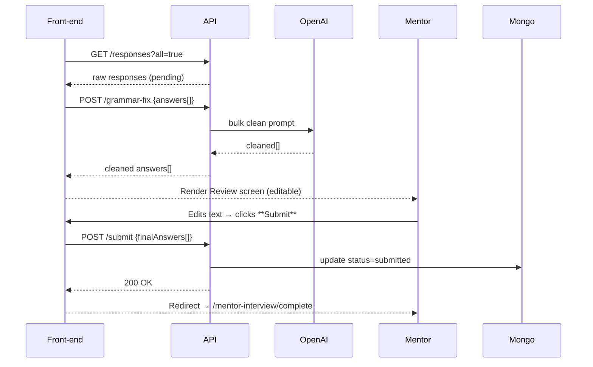

# MELD Mentor Interviewer v3 — “Review & Submit” Feature
**Audience:** Full‑stack engineers extending the existing LibreChat fork for MELD  
**Scope:** Only the post‑interview review + submission flow  
**Last updated:** 2025‑06‑01  

---

## 1 Objective  
After the last adaptive question, mentors can:

1. **Review** every answer in one place, already *AI‑cleaned* for obvious speech‑to‑text errors.  
2. **Optionally edit** the cleaned text.  
3. **Submit** the final set, after which answers become read‑only and are flagged as `submitted`.

---

## 2 Key User Stories

| ID | As a … | I want to … | So that … |
|----|--------|-------------|-----------|
| U1 | Mentor | See all answers on a single page | Verify flow & coherence |
| U2 | Mentor | Fix any mistakes in the cleaned text | Present polished insights |
| U3 | Mentor | Submit once satisfied | Hand control back to MELD |
| U4 | System | Mark each response `submitted` with timestamp | Distinguish drafts from finals |

---

## 3 High‑Level Flow



---

## 4 Functional Requirements

### 4.1 Route & Navigation

| URL | Component | Auth | Description |
|-----|-----------|------|-------------|
| `/mentor-interview/review` | `MentorInterviewReview` | ✔ | Review & edit answers |
| `/mentor-interview/complete` | **unchanged** | ✔ | End slate |

**Change in final question card**

Replace **Finish Interview** button with:

```tsx
<button onClick={() => navigate('/mentor-interview/review')}>
  ✓ Review Answers
</button>
```

### 4.2 `MentorInterviewReview` Component

**Data load**

1. `GET /api/mentor-interest/:id/responses?all=true` → raw answers.  
2. `POST /api/mentor-interest/:id/grammar-fix` with `{answers:[{stage_id,text}]}` → cleaned text array.

**UI**

* One scrollable card per stage (1–3):  
  * **Stage badge** (e.g. “Answer 1 of 3”).  
  * **Original** collapse panel (default closed).  
  * **Cleaned** textarea (full‑width, auto‑grow).  
  * Live word‑count.  
* Global **Submit** button fixed bottom‑right; disabled until all textareas non‑empty and `isSaving===false`.

**Behaviour**

* Editing any textarea sets local `dirty=true`.  
* Clicking **Submit** → `POST /submit` (see below).  
* On 200 OK, navigate to `/mentor-interview/complete`.

### 4.3 API Endpoints

| Verb | Path | Purpose |
|------|------|---------|
| GET | `/api/mentor-interest/:id/responses?all=true` | Return every `MentorResponse` (`pending` or `submitted`) |
| POST | `/api/mentor-interest/:id/grammar-fix` | Return AI‑cleaned versions |
| POST | `/api/mentor-interest/:id/submit` | Persist final text + set `status=submitted` |

#### 4.3.1 `grammar-fix`

```json
// request
{
  "answers": [
    { "stage_id": 1, "text": "raw transcript…" },
    { "stage_id": 2, "text": "…" }
  ]
}
// response
{
  "items": [
    { "stage_id": 1, "cleaned": "Polished text…" },
    { "stage_id": 2, "cleaned": "…" }
  ]
}
```

* Model: `gpt-4o-mini`  
* `temperature:0.1`, `max_tokens` sized to 4× input length.  
* Server returns **only** cleaned text; nothing is saved yet.

#### 4.3.2 `submit`

```json
// request
{
  "answers": [
    { "stage_id": 1, "text": "final user‑edited text" },
    { "stage_id": 2, "text": "…" }
  ]
}
// response
{ "status": "ok", "updated": 3 }
```

Server logic sample:

```js
answers.forEach(({stage_id,text}) =>
  MentorResponse.findOneAndUpdate(
    { mentor_interest: id, stage_id },
    {
      response_text: text,
      status: 'submitted',
      submitted_at: new Date(),
      version: existing.version + 1
    },
    { new:true }
  )
);
```

---

## 5 Data Model Update

```js
MentorResponseSchema.add({
  status: { type: String, enum: ['pending','submitted'], default: 'pending' },
  submitted_at: { type: Date } // nullable
});
```

---

## 6 Non‑Functional Requirements

| Area | Requirement |
|------|-------------|
| Performance | Bulk `grammar-fix` ≤ 3 s P95 |
| Accessibility | Textareas tabbable; submit button has `aria-disabled` |
| Resilience | If `grammar-fix` fails → show raw answers with **Retry** button |
| Analytics | Emit `mentor_interview_submitted` with `{answer_count}` |

---

## 7 Acceptance Criteria

1. **AC‑1** “Review Answers” page loads all stages without loss.  
2. **AC‑2** AI‑cleaned text is visibly corrected (manual QA).  
3. **AC‑3** Submitting sets every `MentorResponse.status === 'submitted'` and page becomes read‑only on reload.  
4. **AC‑4** If OpenAI call fails, mentor can still review raw answers and retry cleaning.  
5. **AC‑5** Mobile (375 × 667) scroll & edit UX passes QA.
