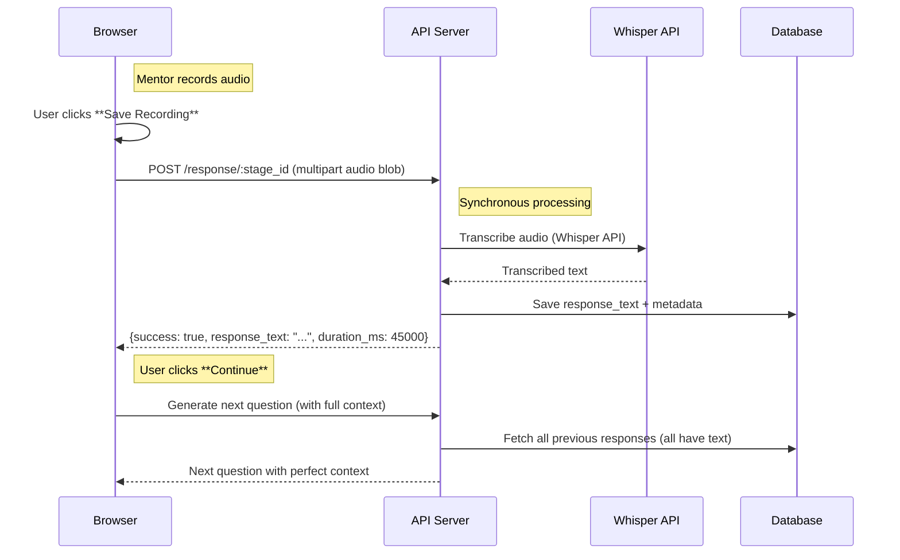

# MELD Mentor Interviewer v5.0 — "Record → Immediate Transcribe → Continue"
**Audience:** Full‑stack engineers familiar with MELD's LibreChat fork  
**Scope:** Switching from background worker transcription to synchronous Whisper transcription  
**Last updated:** 2025‑01‑08  

---

## 1 Objective  

**MAJOR PARADIGM SHIFT:** Move from background transcription to immediate, synchronous transcription.

After each question:
1. Mentor records their answer (with pause/resume).  
2. On **Save Recording**, the app **immediately transcribes** using Whisper API while showing loading state.
3. Transcribed text saved directly to `mentor_responses` table.
4. On **Continue**, navigation happens instantly since transcription is already complete.
5. Next question generation has **full conversation context** immediately available.

**Key Change:** Remove complexity of background workers, Redis queues, and polling in favor of simple request-response flow.

---

## 2 Current State Analysis (Background System)

### 2.1 Current Architecture Issues

**❌ Problems with Background Worker System:**
- Complex infrastructure (Redis, BullMQ, worker processes)
- Race conditions between navigation and transcription completion  
- Next question generation lacks conversation context
- Multiple failure points (queue down, worker down, S3 failures)
- Difficult to debug and monitor transcription status
- Over-engineered for the actual use case

**✅ Benefits of Synchronous System:**
- Simple request-response flow
- Next question always has full context
- Easier error handling and user feedback
- No infrastructure dependencies beyond OpenAI API
- Deterministic behavior and easier testing
- Better user experience with clear loading states

### 2.2 Components Analysis

#### **Backend Components TO DELETE:**
```
api/server/simple-transcription-worker.js         # Background worker implementation
api/server/services/transcriptionQueue.js         # BullMQ queue management  
api/start-transcription-worker.js                 # Worker startup script
```

#### **Backend Components TO MODIFY:**
```
api/server/controllers/MentorInterestController.js # Remove worker endpoints, add sync transcription
api/server/routes/mentorInterest.js                # Remove worker routes, update for multipart
api/models/MentorResponse.js                       # Simplify schema (remove audio_url, status states)
```

#### **Frontend Components TO DELETE:**
```
client/src/hooks/Input/useTranscriptionStatus.ts                          # Background status polling
client/src/components/MentorInterview/BackgroundTranscriptionIndicator.tsx # Progress indicators
client/src/components/MentorInterview/FinalQuestionWaitOverlay.tsx         # Wait overlay
```

#### **Frontend Components TO MODIFY:**
```
client/src/components/MentorInterview/MentorQuestionCard.tsx      # Add sync transcription flow
client/src/components/MentorInterview/MentorInterviewQuestion.tsx # Remove background indicators
```

### 2.3 Current API Endpoints

#### **Endpoints TO REMOVE:**
```
POST   /api/mentor-interview/:token/transcribe/:stage_id    # Sync transcription (just added)
GET    /api/mentor-interview/:token/progress                # Background status tracking  
PATCH  /api/mentor-interview/:token/response/:stage_id      # Worker update endpoint
GET    /api/mentor-interview/:token/debug-queue             # Queue debugging
```

#### **Endpoints TO MODIFY:**
```
POST /api/mentor-interview/:token/response/:stage_id
Current: Accepts {audio_url, duration_ms, status: 'pending'} → enqueues background job
New:     Accepts multipart audio blob → transcribes immediately → saves text
```

### 2.4 Current Database Schema

```typescript
// Current MentorResponse Schema
{
  mentor_interest: ObjectId,
  stage_id: Number,
  response_text: String,        // Transcribed text
  audio_url: String,           // S3 URL (TO REMOVE - no longer needed)
  duration_ms: Number,         // Audio duration (TO KEEP)
  status: String,              // 'pending'|'transcribed'|'submitted' (TO SIMPLIFY → only 'transcribed'|'submitted')
  whisper_model: String,       // Model used (TO KEEP)
  version: Number,
  createdAt: Date,
  updatedAt: Date
}
```

---

## 3 New Synchronous Architecture

### 3.1 User Experience Flow


### 3.2 Technical Sequence



---

## 4 Implementation Plan

### 4.1 Phase 1: Backend Modifications

#### **Step 1: Update Response Endpoint**
**File:** `api/server/controllers/MentorInterestController.js`

**Current Logic (Background):**
```javascript
async function upsertMentorResponse(req, res) {
  const { response_text, audio_url, duration_ms } = req.body;
  
  // Save to database with status 'pending'
  const response = await MentorResponse.findOneAndUpdate(
    { mentor_interest: mentorInterest._id, stage_id: stageId },
    { response_text, audio_url, duration_ms, status: 'pending' },
    { upsert: true, new: true }
  );
  
  // Enqueue background transcription job
  if (audio_url) {
    transcriptionQueue.addJob(/* ... */);
  }
}
```

**New Logic (Synchronous):**
```javascript
async function upsertMentorResponse(req, res) {
  try {
    // Handle multipart form data with audio blob
    if (req.file) {
      // Audio blob uploaded - transcribe immediately
      const audioBuffer = await fs.readFile(req.file.path);
      
      // Use existing STTService for transcription
      const STTService = require('~/server/services/Files/Audio/STTService');
      const sttService = STTService.getInstance();
      const transcription = await sttService.transcribeAudio(audioBuffer, req.file);
      
      // Save transcribed text to database
      const response = await MentorResponse.findOneAndUpdate(
        { mentor_interest: req.mentorInterest._id, stage_id: parseInt(req.params.stage_id) },
        { 
          response_text: transcription.text,
          duration_ms: req.body.duration_ms || 0,
          status: 'transcribed',
          whisper_model: transcription.model || 'whisper-1'
        },
        { upsert: true, new: true }
      );
      
      // Clean up temp file
      await fs.unlink(req.file.path);
      
      return res.json({
        success: true,
        response_text: transcription.text,
        duration_ms: response.duration_ms,
        stage_id: response.stage_id
      });
    } else {
      // Text-only update (existing logic)
      const { response_text } = req.body;
      const response = await MentorResponse.findOneAndUpdate(
        { mentor_interest: req.mentorInterest._id, stage_id: parseInt(req.params.stage_id) },
        { response_text, status: 'transcribed' },
        { upsert: true, new: true }
      );
      
      return res.json({ success: true, response_text, stage_id: response.stage_id });
    }
  } catch (error) {
    logger.error('[upsertMentorResponse] Transcription failed:', error);
    return handleError(res, { text: 'Transcription failed: ' + error.message }, 500);
  }
}
```

#### **Step 2: Remove Background Infrastructure**

**Files TO DELETE:**
```bash
rm api/server/simple-transcription-worker.js
rm api/server/services/transcriptionQueue.js
rm api/start-transcription-worker.js
```

**Functions TO REMOVE from MentorInterestController.js:**
```javascript
// DELETE these functions:
transcribeAndWait()                    # Sync transcription endpoint (no longer needed)
updateMentorResponseTranscription()    # Worker update endpoint
getMentorTranscriptionProgress()       # Background status tracking
```

**Routes TO REMOVE from mentorInterest.js:**
```javascript
// DELETE these routes:
router.post('/:access_token/transcribe/:stage_id', validateAccessToken, transcribeAndWait);
router.get('/:access_token/progress', validateAccessToken, getMentorTranscriptionProgress);
router.patch('/:access_token/response/:stage_id', validateAccessToken, updateMentorResponseTranscription);
router.get('/:access_token/debug-queue', validateAccessToken, debugQueueHandler);
```

#### **Step 3: Update Route Configuration**
**File:** `api/server/routes/mentorInterest.js`

```javascript
// Add multer middleware for audio file uploads
const { upload } = require('~/server/routes/files/multer');

// Modified route - handles both text and audio
router.post('/:access_token/response/:stage_id', 
  validateAccessToken, 
  upload.single('audio'),  // NEW: Accept audio file uploads
  upsertMentorResponse
);
```

#### **Step 4: Database Schema Cleanup**
**File:** `api/models/MentorResponse.js`

```javascript
// Simplified schema - remove audio_url, simplify status
const MentorResponseSchema = new mongoose.Schema({
  mentor_interest: { type: mongoose.Schema.Types.ObjectId, ref: 'MentorInterest', required: true },
  stage_id: { type: Number, required: true },
  response_text: { type: String, default: '' },
  // audio_url: String,  // REMOVE - no longer storing S3 URLs
  duration_ms: { type: Number, default: 0 },
  status: { 
    type: String, 
    enum: ['transcribed', 'submitted'],  // SIMPLIFIED - remove 'pending'
    default: 'transcribed' 
  },
  whisper_model: { type: String, default: 'whisper-1' },
  version: { type: Number, default: 1 }
}, { timestamps: true });
```

### 4.2 Phase 2: Frontend Modifications  

#### **Step 1: Remove Background Components**
**Files TO DELETE:**
```bash
rm client/src/hooks/Input/useTranscriptionStatus.ts
rm client/src/components/MentorInterview/BackgroundTranscriptionIndicator.tsx  
rm client/src/components/MentorInterview/FinalQuestionWaitOverlay.tsx
```

#### **Step 2: Update Recording Component**
**File:** `client/src/components/MentorInterview/MentorQuestionCard.tsx`

**Current Flow (Background):**
```typescript
const handleRecordingComplete = async () => {
  const audioBlob = new Blob(audioChunksRef.current, { type: 'audio/webm' });
  const uploadedUrl = await uploadAudioToS3(audioBlob);  // S3 upload
  await saveAudioResponse(uploadedUrl, durationMs);      // Save URL only
  onContinue?.();  // Immediate navigation
};
```

**New Flow (Synchronous):**
```typescript
const handleRecordingComplete = async () => {
  try {
    setRecordingState('transcribing');  // NEW state
    
    const audioBlob = new Blob(audioChunksRef.current, { type: 'audio/webm' });
    const durationMs = recordingDuration * 1000;
    
    // Create form data with audio blob
    const formData = new FormData();
    formData.append('audio', audioBlob, 'recording.webm');
    formData.append('duration_ms', durationMs.toString());
    
    // POST directly to mentor response endpoint (multipart)
    const response = await fetch(`/api/mentor-interview/${accessToken}/response/${stageId}`, {
      method: 'POST',
      body: formData  // Multipart with audio
    });
    
    if (!response.ok) {
      throw new Error(`Transcription failed: ${response.status}`);
    }
    
    const result = await response.json();
    
    // Show transcribed text to user
    setTranscribedText(result.response_text);
    setRecordingState('complete');
    
  } catch (error) {
    console.error('Transcription failed:', error);
    setRecordingState('error');
    alert(`Transcription failed: ${error.message}`);
  }
};
```

**New Component States:**
```typescript
type RecordingState = 'idle' | 'recording' | 'paused' | 'stopped' | 'transcribing' | 'complete' | 'error';

const [transcribedText, setTranscribedText] = useState<string>('');
```

#### **Step 3: Update Recording UI**

**New Transcribing State:**
```typescript
if (recordingState === 'transcribing') {
  return (
    <div className="flex flex-col items-center justify-center py-8">
      <div className="animate-spin rounded-full h-12 w-12 border-b-2 border-[#B04A2F] mb-4"></div>
      <p className="text-sm text-gray-600">Transcribing your recording...</p>
      <p className="text-xs text-gray-500 mt-1">This usually takes 5-15 seconds</p>
    </div>
  );
}
```

**Show Transcribed Text:**
```typescript
if (recordingState === 'complete' && transcribedText) {
  return (
    <div className="space-y-4">
      <div className="flex items-center justify-center w-20 h-20 rounded-full bg-green-100 mb-4">
        <CheckIcon className="w-8 h-8 text-green-600" />
      </div>
      
      <div className="bg-gray-50 p-4 rounded-lg">
        <h4 className="text-sm font-medium text-gray-700 mb-2">Transcribed Text:</h4>
        <p className="text-gray-900">{transcribedText}</p>
      </div>
      
      <p className="text-xs text-gray-500 text-center">
        Duration: {formatDuration(recordingDuration)}
      </p>
      
      <div className="text-center">
        <p className="text-sm text-green-600 mb-2">✓ Recording transcribed successfully!</p>
        <p className="text-xs text-gray-500">You can now continue to the next question.</p>
      </div>
    </div>
  );
}
```

#### **Step 4: Remove Background Status Tracking**
**File:** `client/src/components/MentorInterview/MentorInterviewQuestion.tsx`

**Remove all background tracking:**
```typescript
// DELETE: Background transcription imports and logic
// import { useTranscriptionStatus } from '~/hooks/Input/useTranscriptionStatus';
// import { BackgroundTranscriptionIndicator } from './BackgroundTranscriptionIndicator';

// DELETE: Status polling
// const { pendingStages, isPolling } = useTranscriptionStatus(accessToken);

// DELETE: Background indicator JSX
// {isPolling && pendingStages.length > 0 && (
//   <BackgroundTranscriptionIndicator 
//     pendingStages={pendingStages}
//     currentStage={currentStage}
//   />
// )}
```

### 4.3 Phase 3: Environment & Dependencies

#### **Dependencies TO REMOVE:**
```json
// Remove from package.json
{
  "dependencies": {
    // "bullmq": "^x.x.x",    // REMOVE
    // "ioredis": "^x.x.x"    // REMOVE (if not used elsewhere)
  }
}
```

#### **Environment Variables:**
```bash
# Required
OPENAI_API_KEY=sk-...          # For Whisper API calls

# No longer required for transcription
// REDIS_HOST=localhost         # DELETE (unless used elsewhere)
// REDIS_PORT=6379              # DELETE
// REDIS_PASSWORD=...           # DELETE
// AWS_BUCKET_NAME=...          # DELETE (no longer storing audio files)
USE_REDIS=false                # Disable Redis for transcription
```

---

## 5 Migration Steps

### 5.1 Migration Sequence

#### **Step 1: Stop Background Infrastructure**
```bash
# Stop worker processes
pm2 stop transcription-worker

# Disable Redis queue (if safe)
# Note: Only if Redis not used for other features
```

#### **Step 2: Database Migration**
```javascript
// Mark all pending responses as transcribed
db.mentor_responses.updateMany(
  { status: 'pending' },
  { $set: { status: 'transcribed' } }
);

// Optional: Remove audio_url field (can keep for historical data)
db.mentor_responses.updateMany(
  {},
  { $unset: { audio_url: "" } }
);
```

#### **Step 3: Backend Code Changes**
```bash
# Remove background worker files
rm api/server/simple-transcription-worker.js
rm api/server/services/transcriptionQueue.js
rm api/start-transcription-worker.js

# Update controller and routes (as detailed above)
# Update database schema
```

#### **Step 4: Frontend Code Changes**
```bash
# Remove background components
rm client/src/hooks/Input/useTranscriptionStatus.ts
rm client/src/components/MentorInterview/BackgroundTranscriptionIndicator.tsx
rm client/src/components/MentorInterview/FinalQuestionWaitOverlay.tsx

# Update recording component (as detailed above)
```

#### **Step 5: Testing & Validation**
```bash
# Test complete flow:
# 1. Record audio with pause/resume
# 2. Transcribe synchronously 
# 3. Verify next question has conversation context
# 4. Test error handling (Whisper API failures)
# 5. Mobile device compatibility
```

---

## 6 Risk Assessment

### 6.1 High Risk Areas

**🔴 STTService Integration**
- **Risk:** Current STTService may not handle mentor interview multipart uploads correctly
- **Mitigation:** Test with existing `/api/files/speech/stt` endpoint first
- **Fallback:** Create dedicated Whisper service if needed

**🔴 User Experience During Transcription**  
- **Risk:** 5-15 second wait may feel slow vs background processing
- **Mitigation:** Clear progress indicators, show transcribed text for verification
- **Fallback:** "Continue anyway" option with manual text entry

**🔴 Whisper API Rate Limits**
- **Risk:** Multiple concurrent users may hit OpenAI limits
- **Mitigation:** Exponential backoff, local request queuing
- **Fallback:** Graceful degradation to text input mode

### 6.2 Success Metrics

**Performance:**
- Transcription Time: Mean < 10s, P95 < 20s (3-minute audio)
- Navigation Speed: < 500ms from "Continue" to next question  
- Error Rate: < 2% transcription failures

**User Experience:**
- Context Quality: Next questions show clear awareness of previous answers
- Completion Rate: ≥ 95% of started interviews completed
- Mobile Compatibility: Works on ≥ 95% of devices (iOS 14+, Android 10+)

---

## 7 Long-term Benefits

### 7.1 Technical Benefits
- **Simplified Architecture:** No background workers, queues, or polling
- **Better Debugging:** Linear request-response flow
- **Reduced Dependencies:** Fewer moving parts and failure points
- **Faster Development:** Simpler mental model for new features

### 7.2 User Experience Benefits  
- **Immediate Context:** Next questions always have full conversation history
- **Predictable Timing:** Users know exactly when transcription happens
- **Better Error Handling:** Clear feedback and recovery options
- **Mobile Optimization:** Simpler flow works better on mobile

### 7.3 Business Benefits
- **Lower Infrastructure Costs:** No Redis cluster or worker processes
- **Faster Time to Market:** Simpler architecture enables faster development
- **Higher Completion Rates:** Better UX leads to more completed interviews
- **Easier Scaling:** Stateless transcription easier to scale horizontally

---

## 8 Implementation Timeline

### 8.1 Recommended Schedule

**Week 1 - Backend Changes:**
- Day 1-2: Update MentorInterestController with sync transcription
- Day 3: Remove background worker infrastructure  
- Day 4: Update routes and middleware for multipart handling
- Day 5: Database migration and testing

**Week 2 - Frontend Changes:**  
- Day 1-2: Remove background components and hooks
- Day 3-4: Update MentorQuestionCard with sync flow
- Day 5: Update parent components and remove feature flags

**Week 3 - Testing & Launch:**
- Day 1-2: End-to-end testing and mobile compatibility
- Day 3: Performance testing and error handling validation
- Day 4: Staging deployment and user acceptance testing
- Day 5: Production deployment with monitoring

---

## 9 Conclusion

This specification outlines the complete transition from a complex background transcription system to a simple, synchronous approach that provides:

**✅ Immediate Context:** Next questions have full conversation history  
**✅ Simplified Architecture:** No workers, queues, or background complexity  
**✅ Better UX:** Clear loading states and predictable timing  
**✅ Easier Development:** Linear flow easier to debug and extend  
**✅ Mobile Friendly:** Simpler flow works better on mobile devices  

The migration removes over 1000 lines of background processing code while providing superior user experience and more reliable conversation context for AI question generation. 